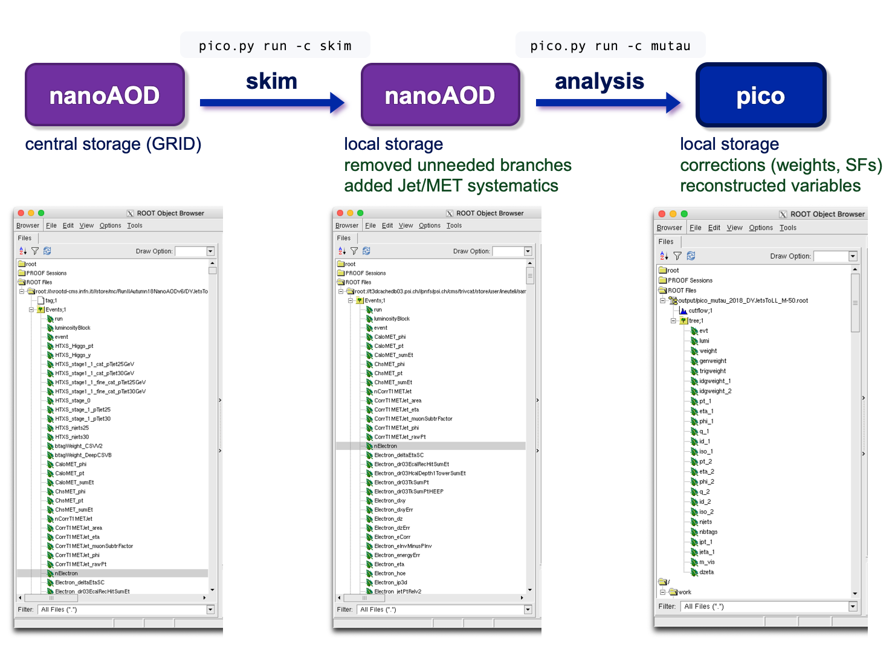

# PicoProducer

This setup runs the [post-processors](https://github.com/cms-nanoAOD/nanoAOD-tools) on nanoAOD.
There are two modes:
1. **Skimming**: Skim nanoAOD by removing [unneeded branches](https://github.com/cms-tau-pog/TauFW/blob/master/PicoProducer/python/processors/keep_and_drop_skim.txt),
                 bad data events (using [data certification JSONs](data/json)),
                 add things like JetMET corrections. Output still has a nanoAOD format.
                 This step is optional, but allows you to run your analysis faster as it is saved locally.
2. **Analysis**: Analyze nanoAOD events by pre-selecting events and objects and constructing new variables.
                 The main analysis code is found in [`python/analysis/`](python/analysis).
                 The output is a custom tree format we will refer to as _pico_.

A central script called [`pico.py`](scripts/pico.py) allows you to run both modes of nanoAOD processing,
either locally or on a batch system.
You can link several skimming or analysis codes to _channels_.




### Table of Contents  
* [Installation](#Installation)<br>
* [Configuration](#Configuration)<br>
  * [Skimming](#Skimming)
  * [Analysis](#Analysis)
  * [Sample list](#Sample-list)
* [Samples](#Samples)<br>
* [Local run](#Local-run)<br>
* [Batch submission](#Batch-submission)<br>
  * [Submission](#Submission)
  * [Resubmission](#Resubmission)
  * [Finalize](#Finalize)
  * [Clean](#Clean)
* [Systematic variations](#Systematic-variations)<br>
* [Plug-ins](#Plug-ins)<br>
  * [Batch system](#Batch-system)
  * [Storage system](#Storage-system)
  * [Analysis module](#Analysis-module)
* [FAQ](#FAQ)


## Installation

You need to have CMSSW and [`NanoAODTools`](https://github.com/cms-nanoAOD/nanoAOD-tools) installed,
see the [README in the parent directory](../../../#taufw). Test the installation with
```
pico.py --help
```
If CMSSW is compiled correctly with `scram b`, then the `pico.py` script should have been
automatically copied from `scripts/` to `$CMSSW_BASE/bin/$SCRAM_ARCH`,
and should be available as a command via `$PATH`.

If you need to access DAS for getting file lists of nanoAOD samples,
make sure you have a GRID certificate installed, and a VOMS proxy setup
```
voms-proxy-init -voms cms -valid 200:0
```
or use the script
```
source utils/setupVOMS.sh
```
Note: If you are on lxplus, you may need to define the location for your temporary VOMS proxy
by executing the following, and adding it to the shell startup script (e.g. `.bashrc`):
```
export X509_USER_PROXY=~/.x509up_u`id -u`
```


## Configuration

The user configuration is saved in [`config/config.json`](config/config.json). Check the contents with `cat`, or use
```
pico.py list
```
You can manually edit the file, or set some variable with
<pre>
pico.py set <i>&lt;variables&gt; &lt;value&gt;</i>
</pre>
For example:
```
pico.py set batch HTCondor
pico.py set jobdir 'output/$ERA/$CHANNEL/$SAMPLE'
```
The configurable variables include:
* `batch`: Batch system to use (e.g. `HTCondor`).
* `jobdir`: Directory to output job configuration and log files (e.g. `output/$ERA/$CHANNEL/$SAMPLE`).
* `outdir`: Directory to copy the output pico files from analysis jobs.
* `nanodir`: Directory to store the output nanoAOD files from skimming jobs.
* `picodir`: Directory to store the `hadd`'ed pico file from analysis job output.
* `nfilesperjob`: Default number of files per job. This can be overridden per sample (see below).
* `filelistdir`: Directory to save list of nanoAOD files to run on (e.g. `samples/files/$ERA/$SAMPLE.txt`).

Defaults are given in [`config/config.json`](config/config.json).
Note the directories can contain variables with `$` like
`$ERA`, `$CHANNEL`, `$CHANNEL`, `$TAG`, `$SAMPLE`, `$GROUP` and `$DAS`
to create a custom hierarchy and format.

The output directories `nanodir` and `picodir` can be special storage systems (e.g. on EOS, T2, T3, ...).
If they need special commands for accessing and writing, please see the [instructions below](#Storage-system).

Besides these variables, there are also dictionaries to link a channel short name to a skimming or analysis code,
or an era (year) to a list of samples.

### Skimming
The "skimming step" is optional. The input and output are both nanoAOD.
You can use it for several things:
* Remove unneeded branches via [keep 'n drop files](https://github.com/cms-tau-pog/TauFW/blob/master/PicoProducer/python/processors/keep_and_drop_skim.txt).
* Remove bad data events using [data certification JSONs](data/json).
* Add new branches, e.g. corrections and systematic variations like JetMET.
  See [these modules](https://github.com/cms-nanoAOD/nanoAOD-tools/tree/master/python/postprocessing/modules),
  or [these analysis examples](https://github.com/cms-nanoAOD/nanoAOD-tools/tree/master/python/postprocessing/examples).
* Pre-selecting events with a simple selection string, e.g. `cut="HLT_IsoMu27 && Muon_pt>20 && Tau_pt>20"`.
* Saving (reduced) nanoAOD files on a local storage system for faster file access,
  as GRID files connections can be slow.

Skimming of nanoAOD files is done by post-processor scripts saved in [`python/processors/`](python/processors).
An example is given by [`skimjob.py`](python/processors/skimjob.py).

You can link your own skimming script to a custom channel short name
```
pico.py channel skim skimjob.py
```
The skimming "channel name" can be whatever string you want,
but it should be unique, contain `skim` to differentiate from analysis channels,
and you should avoid characters that are not safe for filenames, including `:` and `/`.
Extra options to the skimming script can be passed as well:
```
pico.py channel skimjec 'skimjob.py --jec-sys'
```

### Analysis
This framework allows to implement many analysis modules called "channels"
(e.g. different final states like mutau or etau).
All analysis code should be saved in [`python/analysis/`](python/analysis), or a subdirectory.
A simple example of an analysis is given in [`ModuleMuTauSimple.py`](python/analysis/ModuleMuTauSimple.py),
a more fuller example in [`ModuleMuTau.py`](python/analysis/ModuleMuTau.py) 
with more detailed instructions are in [`python/analysis/README.md`](python/analysis).
The `pico.py` script runs all analysis modules with the post-processor [`picojob.py`](python/processors/picojob.py).

You can link any analysis module to a custom channel short name (e.g. `mutau`):
```
pico.py channel mutau ModuleMuTauSimple
```
The channel short name can be whatever string you like (e.g. `mt`, `mymutau`, `MuTau`, ...).
However, you should avoid characters that are not safe for filenames, including `:` and `/`,
and it should not contain `skim` (reserved for skimming).
To include extra options to the module of a channel, do e.g.
```
pico.py channel mutau_TESUp ModuleMuTau 'tessys=Up'
pico.py channel mutau_TES1p03 ModuleMuTau 'tes=1.03'
```

### Sample list
To link an era to your favorite sample list in [`samples/`](samples/), do
```
pico.py era 2016 sample_2016.py
```


## Samples

The nanoAOD samples you like to process should be specified in python file in [`samples/`](samples).
Each era (year) should be linked to a sample list, as explained above.
The file must include a python list called `samples`, containing [`Sample`](python/storage/Sample.py) objects
(or those from the derived `MC` and `Data` classes). For example,
```
samples = [
  Sample('DY','DYJetsToLL_M-50',
    "/DYJetsToLL_M-50_TuneCUETP8M1_13TeV-madgraphMLM-pythia8/RunIISummer16NanoAODv6-PUMoriond17_Nano25Oct2019_102X_mcRun2_asymptotic_v7_ext1-v1/NANOAODSIM",
    dtype='mc',store=None,url="root://cms-xrd-global.cern.ch/",opts='zpt=True',
  )
]
```
The `Samples` class takes at least three arguments:
1. The first string is a user-chosen name to group samples together (e.g. `'DY'`, `'TT'`, `'VV'`, `'Data'`).
2. The second is a custom, unique short name for the sample  (e.g. `'DYJetsToLL_M-50'`, `'SingleMuon_Run2016C'`). 
3. The third and optionally additional arguments are the full DAS paths of the sample.
Multiple DAS paths for the same sample can be used to combine extensions.

Other optional keyword arguments are
* `dtype`: Data type like `'mc'`, `'data'` or `'embed'`. As a short cut you can use the subclasses `MC` and `Data`.
* `store`: Path where all nanoAOD files are stored (instead of being given by the DAS tool).
  Note that this path is used for both skimming and analysis jobs.
  This is useful if you have produced or skimmed your NanoAOD samples, and they are not available via DAS.
  The path may contain variables like `$DAS` for the full DAS dataset path, `$GROUP` for the group, `$SAMPLE` for the sample short name.
* `url`: Redirector URL for `XRootD` protocol, e.g. `root://cms-xrd-global.cern.ch` for DAS.
* `files`: Either a list of nanoAOD files, OR a string to a text file with a list of nanoAOD files.
  This can speed things up if DAS is slow or unreliable,
  or you want to avoid retrieving the files from a local storage element on the fly each time.
  Note that this list is used for both skimming and analysis jobs.
* `nevents`: The total number of nanoAOD events, that you can optionally compare to the number of processed events (with the `--das` flag).
  By default, it will be obtained from DAS, but it can be set by the user to speed things up,
  or in case the sample is not available on DAS.
* `nfilesperjob`: Number filed per job. If the samples is split in many small files,
  you can choose a larger `nfilesperjob` to reduce the number of short jobs.
  This overrides the default `nfilesperjob` in the configuration.
* `blacklist`: A list of files that you do not want to run on. This is useful if some files are corrupted.
* `opts`: Extra key-worded options (`key=value`) to be passed to the analysis modules.
  Can be a comma-separated string (`'opt1=val1,opt2=val2'`) or a list of strings (`['opt1=val1','opt2=val2']`).

Note that a priori skimming and analysis channels use the same sample lists (and therefore the same nanoAOD files)
for the same era as specified in the configuration.
While skimming is an optional step, typically you first want to skim nanoAOD from existing files on the GRID (given by DAS)
and store them locally for faster and more reliable access.
To run on skimmed nanoAOD files, you need to change `store` for each skimmed sample to point to the storage location.

To get a file list for a sample in the sample list, you can use the `get files` subcommand.
If you include `--write`, the list will be written to a text file as defined by `filelistdir` in the [configuration](#Configuration):
```
pico.py get files -y 2016 -s DYJets --write
```


## Local run
A local run can be done as
<pre>
pico.py run -y <i>&lt;era&gt;</i> -c <i>&lt;channel&gt;</i>
</pre>
For example, to run the `mutau` channel on a `2016` sample, do
```
pico.py run -y 2016 -c mutau
```
Use `-m 1000` to limit the number of processed events.
By default, the output will be saved in a new directory called `ouput/`.
Because `mutau` is an analysis module, the output will be a root file that contains a tree called `'tree'`
with a custom format defined in [`ModuleMuTauSimple.py`](python/analysis/ModuleMuTauSimple.py).
If you run a skimming channel, which must have `skim` in the channel name, the output will be a nanoAOD file.

Automatically, the first file of the first sample in the era's list will be run, but you can
specify a sample that is available in the [sample list linked to the era](samples/samples_2016.py),
by passing the `-s` flag a pattern:
```
pico.py run -y 2016 -c mutau -s SingleMuon
pico.py run -y 2016 -c mutau -s 'DYJets*M-50'
pico.py run -y 2016 -c mutau -s 'DY[23]Jets*M-50'
```
Glob patterns like `*`, `?` or `[…]` wildcards are allowed.
Some modules allow extra options via keyword arguments. You can specify these using the `--opts` flag:
```
pico.py run -y 2016 -c mutau -s DYJets*M-50 --opts tes=1.1
```
For all options, see
```
pico.py run --help
```


## Batch submission

### Submission
Once the module run locally, everything is [configured](#Configuration) and
[your batch system is installed](#Plug-ins), you can submit with
```
pico.py submit -y 2016 -c mutau
```
This will create the the necessary output directories for job configuration (`jobdir`)
and output (`nanodir` for skimming, `outdir` for analysis).
A JSON file is created to keep track of the job input and output.

Again, you can specify a sample by passing a glob patterns to `-s`, or exclude patterns with `-x`.
To give the output files a specific tag, use `-t`.

For all options with submission, do
```
pico.py submit --help
```


### Status
Check the job status with
```
pico.py status -y 2016 -c mutau
```
This will check which jobs are still running, and if the output files exist and are not corrupted.
For skimming jobs, the nanoAOD output files should appear in `nanodir`, and they are checked for having an `Events` tree.
For analysis jobs, the pico output files should appear in `outdir`, and they are checked for having a tree called `tree`,
and a histogram called `cutflow`.
To compare how many events were processed compared to the total available events in DAS (or defined in `Sample`), use the `--das` flag:
```
pico.py status -y 2016 -c mutau --das
```

### Resubmission
If jobs failed, you can resubmit with
```
pico.py resubmit -y 2016 -c mutau
```
This will resubmit files that are missing or corrupted (unless they are associated with a running job).
In case the jobs take too long, you can specify a smaller number of files per job with `--filesperjob` on the fly,
or use `--split` to split the default number.


### Finalize
ROOT files from analysis output can be `hadd`'ed into one large pico file:
```
pico.py hadd -y 2016 -c mutau
```
The output file will be stored in `picodir`.
This will not work for channels with `skim` in the name,
as it is preferred to keep skimmed nanoAOD files split for further batch submission.


### Clean
Remove leftover log files and directories with the `clean` subcommand
(or use `-r` with `hadd`):
```
pico.py clean -y 2016 -c mutau
```


## Systematic variations

Systematic variations can be run by passing extra keyword options via `-E`, e.g.:
```
pico.py run -y 2016 -c mutau -s DY TT -E 'tes=1.03' -t _TES1p03
pico.py run -y 2016 -c mutau -s DY TT -E 'tes=0.97' -t _TES0p97
```
The keyword argument, e.g. `tes` for tau energy scale,
must already be defined in the analysis module linked to the channel, see e.g.
[here](https://github.com/cms-tau-pog/TauFW/blob/91206107e6adb564ef4fb8b92e023a0c1744a7f8/PicoProducer/python/analysis/ModuleTauPair.py#L35)
[here](https://github.com/cms-tau-pog/TauFW/blob/91206107e6adb564ef4fb8b92e023a0c1744a7f8/PicoProducer/python/analysis/ModuleMuTau.py#L121-L129)
for `ModuleMuTau`.
And extra tag should be added with `-t` to avoid overwriting the nominal analysis output.
As a shortcut, you can define a new channel with the same module, but a different setting:
```
pico.py channel mutau_TES1p03 'ModuleMuTau tes=1.03'
pico.py channel mutau_TES0p97 'ModuleMuTau tes=0.97'
pico.py run -y 2016 -c mutau_TES1p03 -s DY TT
pico.py run -y 2016 -c mutau_TES0p97 -s DY TT
```
After you defined your systematic channels,
you can edit and use the [`vary.sh`](utils/vary.sh) script to quickly run multiple variations, e.g.
```
cp utils/vary.sh ./
vary.sh run -c mutau -y UL2017 -T
vary.sh submit -c mutau -y UL2017 -T
```
etc.


## Plug-ins

This framework might not work for your computing system... yet.
It was created with a modular design in mind, meaning that users can add their own
"plug-in" modules to make it work with their own batch system and storage system.
If you like to contribute, please make sure the changes run as expected,
and then push the changes to a fork to make a pull request.

### Batch system
To plug in your own batch system, make a subclass of [`BatchSystem`](python/batch/BatchSystem.py),
overriding the abstract methods (e.g. `submit`).
Your subclass has to be saved in separate python module in [`python/batch/`](python/batch),
and the module's filename should be the same as the class.
See for example [`HTCondor.py`](python/batch/HTCondor.py).
If you need extra (shell) scripts, leave them in `python/batch` as well.
Then you need to implement your `submit` command to the `main_submit` function in
[`pico.py`](https://github.com/cms-tau-pog/TauFW/blob/b4d14574226b095d020936eb54c3d8bb995624d3/PicoProducer/scripts/pico.py#L1007-L1030),
where you define the script and some extra keyword options via `jkwargs`, for example:
```
def main_submit(args):
  ...
    elif batch.system=='SLURM':
      script  = "python/batch/submit_SLURM.sh %s"%(joblist)
      logfile = os.path.join(logdir,"%x.%A.%a") # $JOBNAME.o$JOBID.$TASKID
      jkwargs.update({'log': logfile })
  ...
```
Test your implementation with this test script:
<pre>
test/testBatch.py <i>&lt;batchsystem&gt;</i> -v1
</pre>

### Storage system
Similarly for a storage element, subclass [`StorageSystem`](python/storage/StorageSystem.py)
in [`python/storage/`](python/storage).
Have a look at [`T3_PSI`](python/storage/T3_PSI.py) as an example of a subclass.
Currently, the code automatically assigns a path to a storage system, so you also need to 
edit `getstorage` in [`python/storage/utils.py`](python/storage/utils.py), e.g.
```
def getstorage(path,verb=0,ensure=False):
  ...
  elif path.startswith('/pnfs/psi.ch/'):
    from TauFW.PicoProducer.storage.T3_PSI import T3_PSI
    storage = T3_PSI(path,ensure=ensure,verb=verb)
  ...
  return storage
```
You can test your implementation with
<pre>
test/testStorage.py <i>&lt;path&gt;</i> -v3
</pre>
where you pass an absolute path on your storage system. 

If you want, you can also add the path of your storage element to `getsedir` in the same file.
This help function automatically sets the default paths for new users, based on the host and user name.

### Analysis module
Detailed instructions to create an analysis module are provided [in the README of `python/analysis`](python/analysis/#PicoProducer-Analysis-Code).

If you want to share your analysis module (e.g. for TauPOG measurements),
please make a new directory in `python/analysis`,
where you save your analysis modules with a [`Module`](https://github.com/cms-nanoAOD/nanoAOD-tools/blob/master/python/postprocessing/framework/eventloop.py)
subclass. For example, reusing the full examples:
```
cd python/analysis
mkdir MuTauFakeRate
cp TreeProducerMuTau.py MuTauFakeRate/TreeProducerMuTau.py
cp ModuleMuTau.py MuTauFakeRate/ModuleMuTau.py
```
Rename the module class to the filename (in this example `ModuleMuTau` stays the same) and
edit the the pre-selection and tree format in these modules to your liking.
Test run as
```
pico.py channel mutau python/analysis/MuTauFakeRate/ModuleMuTau.py
pico.py run -c mutau -y 2018
```


## FAQ

Here are some frequently asked questions and hints during troubleshooting.

* [Is the skimming step required ?](#is-the-skimming-step-required-)<br>
* [How do I make my own analysis module ?](#how-do-i-make-my-own-analysis-module-)<br>
* [What should be the format of my "pico" analysis ntuples ?](#what-should-be-the-format-of-the-pico-analysis-ntuples-)<br>
* [How do I plot my analysis output ?](#how-do-i-plot-my-analysis-output-)<br>
* [Why do I get a `no branch named ...` error message ?](#why-do-i-get-a-no-branch-named--error-message-)<br>
* [Why do I get a `no branch named MET_pt_nom` error message ?](#why-do-i-get-a-no-branch-named-met_pt_nom-error-message-)<br>
* [Why do my jobs fail ?](#why-do-my-jobs-fail-)<br>
* [Why do my jobs take so long ?](#why-do-my-jobs-take-so-long-)<br>


### Is the skimming step required ?

No. It is optional, but recommended if you do not have the nanoAOD files stored locally.
[Skimming](#Skimming) is meant to reduce the file size by removing unneeded branches and/or events,
plus to store the nanoAOD files locally for faster access.

You can also use the skimming step to add JEC corrections and systematic variations, or
[other neat stuff](https://github.com/cms-nanoAOD/nanoAOD-tools/tree/master/python/postprocessing/modules).


### How do I make my own analysis module ?

Examples and instructions are provided in the [`README` in `python/analysis`](python/analysis#Picoproducer-analysis-code).
The simplest one is [`ModuleMuTauSimple.py`](python/analysis/ModuleMuTauSimple.py).
This creates a new flat tree as output.
Alternatively, you do analysis with nanoAOD as output, following
[these examples](https://github.com/cms-nanoAOD/nanoAOD-tools/tree/master/python/postprocessing/examples).


### What should be the format of the "pico" analysis ntuples ?

Whatever you like. It can be a flat tree, it can be just histograms; it can even be nanoAOD again.
It really depends how you like to do your analysis.


### How do I plot my analysis output ?

See the instructions in the [`Plotter` package](../Plotter).
To interface with your analysis tuples, use the [`Plotter.sample.Sample` class](../Plotter/python/sample/Sample.py).
For a full example, hone into [these instructions](../Plotter#Plotting-script).


### Why do I get a `no branch named ...` error message ?

Because the branch is not available in your nanoAOD input file.
Please check the code of your module in [`python/analysis`](python/analysis).

Documentation of the available branches can also be found
[here](https://cms-nanoaod-integration.web.cern.ch/integration/master-106X/mc102X_doc.html),
although this page can be outdated for your version of nanoAOD.
The same information is saved in the ROOT file itself; open the input nanaAOD with ROOT
and look for the available branches with a `TBrowser` or the `Tree::Print` function, e.g.
```
Events->Print("Tau_*")
```
The exact definition of the default branches can be found in
[`CMSSW/PhysicsTools/NanoAOD`](https://github.com/cms-sw/cmssw/tree/master/PhysicsTools/NanoAOD).


### Why do I get a `no branch named MET_pt_nom` error message ?

By default, the full tau pair analysis modules assume that the JEC variations are available.
If you did not run JEC variations in the skimming step, please disable it via the `-E` option,
```
pico.py run -c mutau -y 2018 -E jec=False
```
or fix it once and for all via 
```
pico.py channel mutau 'MuTauModule jec=False'
pico.py run -c mutau -y 2018
```
Alternatively, you could edit the module file locally, setting the
[hardcoded default](https://github.com/cms-tau-pog/TauFW/blob/828faddc0862229e827207fc04a7903562930eb7/PicoProducer/python/analysis/ModuleTauPair.py#L44)
to `False`.


### Why do my jobs fail ?

First make sure it runs locally with `pico.py run`.
If it runs locally and your jobs still fail,
you can find out the reason by looking into the job log files.
You can find them in `jobdir`, which by default is set to `output/$ERA/$CHANNEL/$SAMPLE`,
or via
```
pico.py status -c mutau -y 2018 -l
```
Make sure that your VOMS proxy is valid,
```
voms-proxy-init -voms cms -valid 200:0
```
and that your batch system can access the ROOT input files and the TauFW working directory.
Double check the configuration of the output directories with
```
pico.py list
```
or during submission, set the verbosity high
```
pico.py submit -c mutau -y 2018 -v2
```

If the jobs were terminated because of time limitations,
you can edit the default batch submission files in `python/batch/`,
or pass time option to the submission command via `--time`, e.g for 10 hours:
```
pico.py resubmit -c mutau -y 2018 --time 10:00:00
```
Other options specific to your batch system can be added via `-B`.

If you are on CERN's `lxplus`, you may need to define the location for your temporary VOMS proxy
by executing the following, and adding it to the shell startup script (e.g. `.bashrc`):
```
export X509_USER_PROXY=~/.x509up_u`id -u`
```

If you use HTCondor, double check the actual maximum run time for any job via
(`jobid`="clusterId", `taskid`="procId")
```
condor_q -long <jobid>.<taskid>
```


### Why do my jobs take so long ?

Make sure that `nfilesperjob` in the configuration is small enough.
Furthermore, file connections to GRID can often be slow.
One immediate solution to this is to pass the "prefetch" option, `-p`,
which first copies the input file to the local working directory,
and removes it at the end of the job:
```
pico.py submit -c mutau -y 2018 -p
```
If you repeatedly run on the same nanoAOD files that are stored on the GRID,
consider doing a skimming step to reduce their file size and save them on a local storage system for faster connection.

Note: In the future, event-based splitting will be added to break up large input nanoAOD files into smaller pieces per job.


