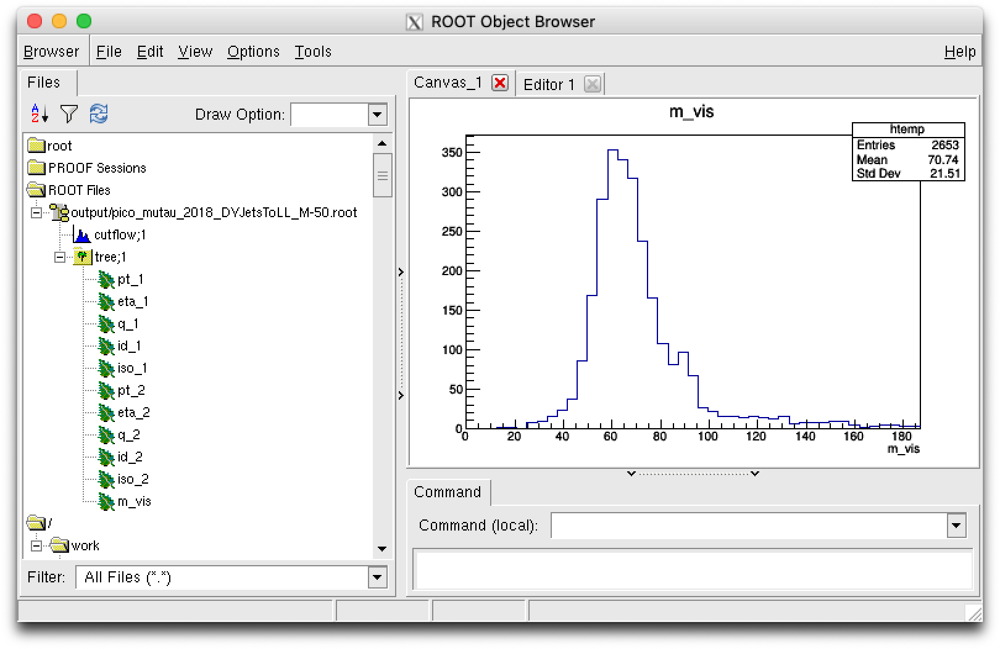
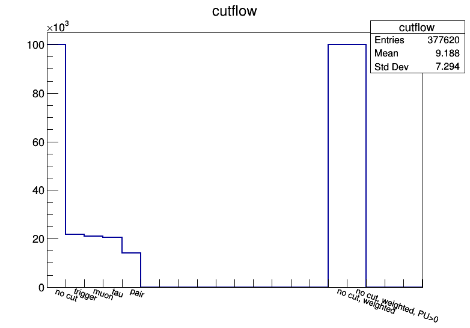
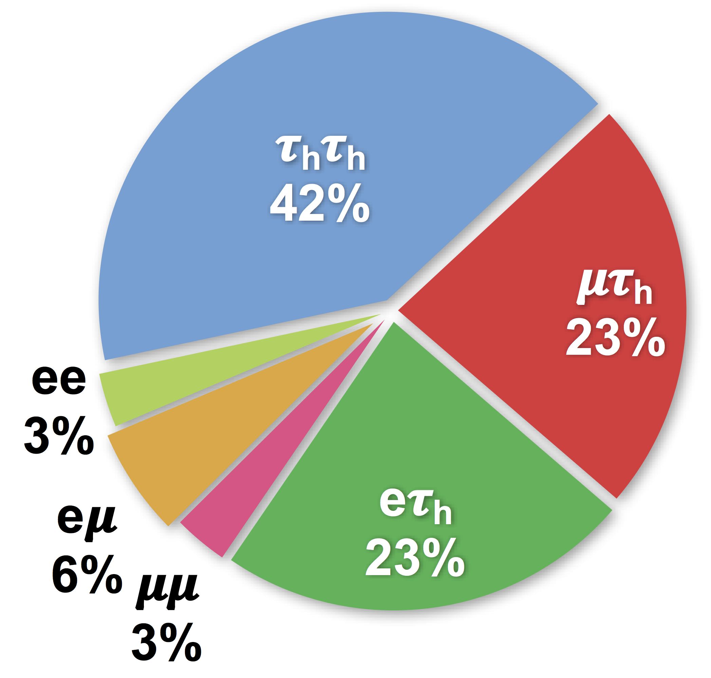

# PicoProducer analysis code

These modules are used to process nanoAOD for analysis. Analysis modules
1. **pre-select** events, e.g. those passing some trigger and containing a muon-tau pair;
2. **reconstruct** variables like invariant mass;
3. **apply corrections**, like energy scale, SFs, weights, etc;
4. **save variables** in branches of a custom tree (ntuple).
The analysis modules are run on nanoAOD with the [post-processors](https://github.com/cms-nanoAOD/nanoAOD-tools),
for example with [`picojob.py`](../processors/skimjob.py).
The output is a custom analysis ntuple, we refer to as the _pico_ format.

### Table of Contents  
* [Run](#Run)<br>
* [Accessing nanoAOD](#Accessing-nanoAOD)<br>
* [Custom tree format](#Custom-tree-format)<br>
* [Cutflow](#Cutflow)<br>
* [Tau pair analysis](#Tau-pair-analysis)<br>
* [Corrections](#Corrections)<br>


## Run
To run to an analysis module with `pico.py`, you can link the module to a channel shortname in several ways, e.g.
```
pico.py channel mutau ModuleMuTau
pico.py channel mutau python/analysis/ModuleMuTau.py
```
and then run it with e.g.
```
pico.py run -c mutau -y 2016
```
For more detailed instructions on `pico.py`, see the [README in the grandparent folder](../../#picoproducer).

### Hierarchy
To run analysis modules with `pico.py`, the modules should always by in this directory (`python/analysis/`),
but you can organize your modules in subdirectories, e.g.
```
pico.py channel mutau MyAnalysis.ModuleMyMuTau
pico.py channel mutau python/analysis/MyAnalysis/ModuleMyMuTau.py
```
Furthermore, the module file should have the exact same name as the module class it contains,
e.g. [`ModuleMuTau.py`](ModuleMuTau.py) contains `ModuleMuTau`.


## Accessing nanoAOD
Please refer to the [nanoAOD documentation](https://cms-nanoaod-integration.web.cern.ch/integration/master-102X/mc102X_doc.html)
for a full list of available variables.
To know how they are defined from miniAOD, you can dig in the CMSSW source code in
[`cmssw/PhysicsTools/NanoAOD`](https://github.com/cms-sw/cmssw/tree/master/PhysicsTools/NanoAOD).

To access information of nanoAOD using `python`, you can subclass [`Module`](https://github.com/cms-nanoAOD/nanoAOD-tools/blob/master/python/postprocessing/framework/eventloop.py)
from the [`nanoAOD-tools`](https://github.com/cms-nanoAOD/nanoAOD-tools).
A simple example of a subclass to analyze nanoAOD is given in [`ModuleMuTauSimple.py`](ModuleMuTauSimple.py).
The `Module` class has some pre-defined methods like `beginJob` and  `endJob` that are called by
[`PostProcessor`](https://github.com/cms-nanoAOD/nanoAOD-tools/blob/master/python/postprocessing/framework/postprocessor.py),
but the main routine is in `analyze`, for example:
```
from PhysicsTools.NanoAODTools.postprocessing.framework.eventloop import Module
class ModuleMuTauSimple(Module):
  def analyze(self,event):
    muon_idx = [ ]
    for imuon in event.nMuon:
      if event.Muon_pt[imuon]>20:
        muon_idx.append(imuon)
    if len(muon_idx)<1:
      return False
    return True
```
The `analyze` method should return `True` if the event passes your pre-selection,
and you like to keep its information, and `False` otherwise.
Without loss of performance, you can make the latter more readable using
[`Collection`](https://github.com/cms-nanoAOD/nanoAOD-tools/blob/master/python/postprocessing/framework/datamodel.py):
```
from PhysicsTools.NanoAODTools.postprocessing.framework.eventloop import Module
from PhysicsTools.NanoAODTools.postprocessing.framework.datamodel import Collection
class ModuleMuTauSimple(Module):
  def analyze(self, event):
    muons = [ ]
    for muon in Collection(event,'Muon'):
      if muon.pt>20:
        muons.append(muon)
    if len(muons)<1:
      return False
    return True
```
Triggers are saved as booleans, e.g.
```
    if not event.HLT_IsoMu24:
      return False
```
To reduce the nanoAOD file size, some identification working points (WPs) are saved in nanoAOD as `UChar_t`, which is 1 byte (8 bits),
instead of 4 bytes (32 bits) like `Int_t`. For example, to require the Medium WP of the `DeepTau2017v2p1VSjet` tau identification,
you see in the [documentation](https://cms-nanoaod-integration.web.cern.ch/integration/master-102X/mc102X_doc.html#Tau)
that it corresponds to the fifth bit, i.e. `16`.
To access them in `python`, you may need the [built-in function `ord`](https://docs.python.org/3/library/functions.html#ord), e.g.
```
    tau_idx = [ ]
    for itau in event.nTau:
    if event.Tau_pt[itau]>20 and ord(event.Tau_idDeepTau2017v2p1VSjet[itau])>=16:
      tau_idx.append(itau)
```
If you use `Collections`, you do not need `ord` anymore:
```
    taus = [ ]
    for tau in Collection(event,'Tau'):
      if tau.pt>20 and tau.idDeepTau2017v2p1VSjet>=16:
        taus.append(tau)
```
Beside WPs, status flags like the integer [`GenPart_statusFlags` of generator particles](https://cms-nanoaod-integration.web.cern.ch/integration/master-102X/mc102X_doc.html#GenPart)
are also encoded bitwise. If you want to know if some flag like `isPrompt` (0th bit, `1`) or `isHardProcess` (7th bit, `128`) is triggered,
use [bitwise operators](https://www.tutorialspoint.com/python/bitwise_operators_example.htm) as
```
isPrompt    = GenPart_statusFlags[i] & 1
hardProcess = GenPart_statusFlags[i] & 128
```
which has values `0` or `1`. Here, `128` is computed as a power of 2, `2**7`, or a bitwise left shift, `1<<7`.
The help function `hasbit` in [`utils.py`](utils.py) can be used:
```
isPrompt    = hasbit(GenPart_statusFlags[i],0)
hardProcess = hasbit(GenPart_statusFlags[i],7)
```


## Custom tree format
A simple example to make your custom tree is given in [`ModuleMuTauSimple.py`](ModuleMuTauSimple.py). Reduced:
```
import numpy as np
class ModuleMuTauSimple(Module):
  def __init__(self,fname,**kwargs):
    self.outfile = TFile(fname,'RECREATE')
  def beginJob(self):
    self.tree = TTree('tree','tree')
    self.pt_1 = np.zeros(1,dtype='f') # 32-bit float
    self.q_1  = np.zeros(1,dtype='i') # 32-bit integer
    self.id_1 = np.zeros(1,dtype='?') # 1 byte boolean
    self.tree.Branch('pt_1',self.pt_1,'pt_1/F') # Float_t
    self.tree.Branch('q_1', self.q_1, 'q_1/I')  # Int_t
    self.tree.Branch('id_1',self.id_1,'id_1/O') # Boot_t
  def analyze(self, event):
    self.pt_1[0] = 20.0
    self.q_1[0]  = -1
    self.id_1[0] = True
    self.tree.Fill()
    return True
  def endJob(self):
    self.outfile.Write()
    self.outfile.Close()
```
<p align="center">
  
</p>

More information on data types for defining the right numpy arrays and branches:
* In `ROOT`: https://root.cern.ch/doc/master/classTTree.html#addcolumnoffundamentaltypes
* In `numpy`: https://numpy.org/devdocs/user/basics.types.html

| ROOT      | [Branch](https://root.cern.ch/doc/master/classTTree.html#addcolumnoffundamentaltypes) | [`numpy`](https://numpy.org/devdocs/user/basics.types.html) | [`array`](https://docs.python.org/3/library/array.html) | Data type |
|-----------|----------|-----------------------------|----------|--------------------------|
| Bool_t    | `'O'`    | `'?'`, `'bool'`, `bool`     |          |   8-bit boolean          |
| UChar_t   | `'b'`    | `'b'`, `'byte'`, `'int8'`   | `'B'`    |   8-bit unsigned integer |
| Int_t     | `'I'`    | `'i'`, `'int32'`            | `'l'`    |  32-bit (signed) integer |
| Long64_t  | `'L'`    | `'l'`, `'int62'`, `long`    | `'q'`    |  64-bit (signed) integer |
| Float_t   | `'F'`    | `'f'`, `'float32'`          | `'f'`    |  32-bit float            |
| Double_t  | `'D'`    | `'d'`, `'float64'`, `float` | `'d'`    |  64-bit float            |

To make your life easier, you can use separate "tree producer" classes.
For example, [`TreeProducer`](TreeProducer.py) can be subclassed as in [`TreeProducerMuTau.py`](TreeProducerMuTau.py).
You then define branches with something like
```
from TauFW.PicoProducer.analysis.TreeProducer import TreeProducer
class TreeProducerMuTau(TreeProducer):
  def __init__(self, filename, module, **kwargs):
    super(TreeProducer,self).__init__(filename,module,**kwargs)
    self.addBranch('pt_1','f') # float
    self.addBranch('q_1', 'i') # integer
    self.addBranch('id_1','?') # boolean
```
In the main analysis module [`ModuleMuTau.py`](ModuleMuTau.py), you basically do
```
from TauFW.PicoProducer.analysis.TreeProducerMuTau import TreeProducerMuTau
class ModuleMuTau(Module):
  def __init__(self, fname, **kwargs):
    self.out = TreeProducerMuTau(fname,self)
  def analyze(self, event):
    self.out.pt_1[0] = 20.0
    self.out.q_1[0]  = -1
    self.out.id_1[0] = True
    self.out.fill()
    return True
```


## Cutflow
To keep track of the total number of processed events,
and efficiencies of each step in the pre-selection, one should use a cuflow.
This is a simple histogram, binned per integer, that is filled each time a pre-selection is passed.
Again, [`ModuleMuTauSimple.py`](ModuleMuTauSimple.py) provides a straightforward solution.

The [`TreeProducer`](TreeProducer.py) class already uses a special `Cutflow` class,
that can be used as
```
class ModuleMuTau(Module):
  def __init__(self, fname, **kwargs):
    self.out = TreeProducer(fname,self)
    self.out.cutflow.addcut('none',  "no cut"   ) # bin 1 (0-1): total number of events
    self.out.cutflow.addcut('trig',  "trigger"  ) # bin 2 (1-2): number of events passing the trigger
    self.out.cutflow.addcut('muon',  "muon"     ) # bin 3 (2-3): number of events with pre-selected muon
    self.out.cutflow.addcut('tau',   "tau"      ) # bin 4 (3-4): number of events with pre-selected tau
    self.out.cutflow.addcut('weight',"weight",15) # bin 16 (15-16): total sum of weights (for MC only)
  def analyze(self, event):
    self.out.cutflow.fill('none')
    self.out.cutflow.fill('weight',event.genWeight)
    # require trigger, else return False...
    self.out.cutflow.fill('trig')
    # require muon, else return False...
    self.out.cutflow.fill('muon')
    # require tau, else return False...
    self.out.cutflow.fill('tau')
    return True
```
Note that if the generator weight in MC is very different than 1.0 (e.g. for some ttbar samples),
it can be useful to save the total sum of weights of all processed events,
so it can be used in the denominator of the lumi-cross section normalization,
instead of using the total number of MC events.

<p align="center">
  
</p>


## Tau pair analysis
A set of full analysis modules for the basic study of events with a pair of tau decay candidates
(like Z → 𝜏𝜏 events meant for TauPOG studies) are provided.
They follow this hierarchy:
* [`TreeProducer`](TreeProducer.py): general superclass for containing the output file, tree and cutflow
  * [`TreeProducerTauPair`](TreeProducerTauPair.py) provides common branches in ditau analyses
    * [`TreeProducerMuTau`](TreeProducerMuTau.py) for the mutau channel
    * [`TreeProducerETau`](TreeProducerETau.py) for the etau channel
    * [`TreeProducerTauTau`](TreeProducerTauTau.py) for the tautau channel
    * [`TreeProducerMuMu`](TreeProducerMuMu.py) for the mumu channel
    * [`TreeProducerEMu`](TreeProducerEMu.py) for the emu channel
* [`Module`](https://github.com/cms-nanoAOD/nanoAOD-tools/blob/master/python/postprocessing/framework/eventloop.py): general superclass for nanoAOD processing
  * [`ModuleTauPair`](ModuleTauPair.py) provides common routines like jet selection or ditau reconstruction (`mt`, `m_vis`, `dR_ll`, etc.)
    * [`ModuleMuTau`](ModuleMuTau.py) for the mutau channel
    * [`ModuleETau`](ModuleETau.py) for the etau channel
    * [`ModuleTauTau`](ModuleTauTau.py) for the tautau channel
    * [`ModuleMuMu`](ModuleMuMu.py) for the mumu channel
    * [`ModuleEMu`](ModuleEMu.py) for the emu channel

(Note they are still under construction, and more will be added in the near future.)

<p align="center">
  
</p>


## Corrections
Correction tools are found in [`python/corrections/`](../corrections) and
corresponding weights, scale factors and more in [`data/`](../../data).

