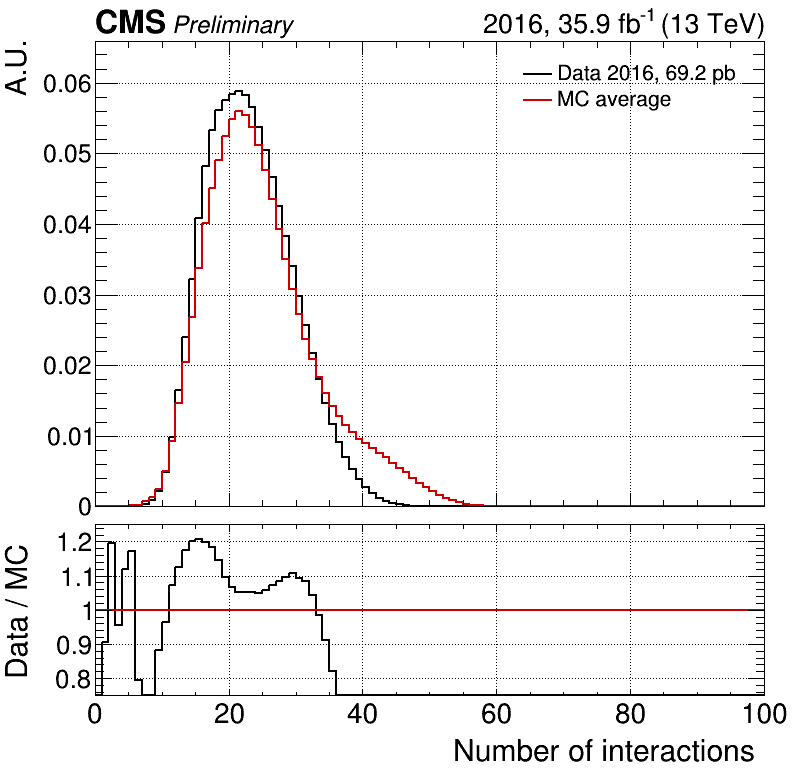
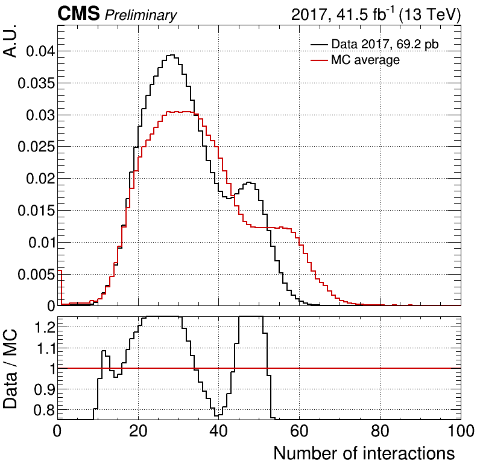
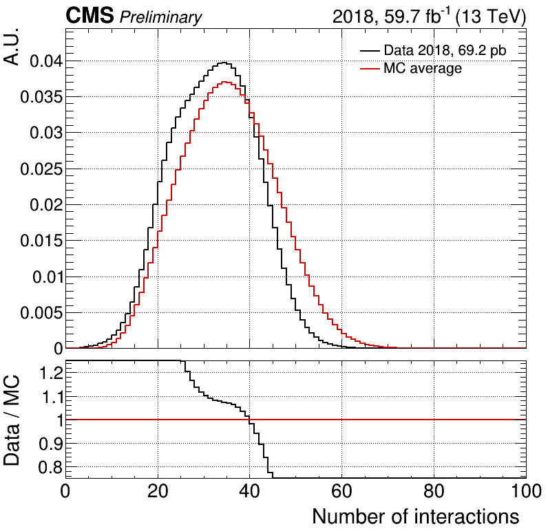
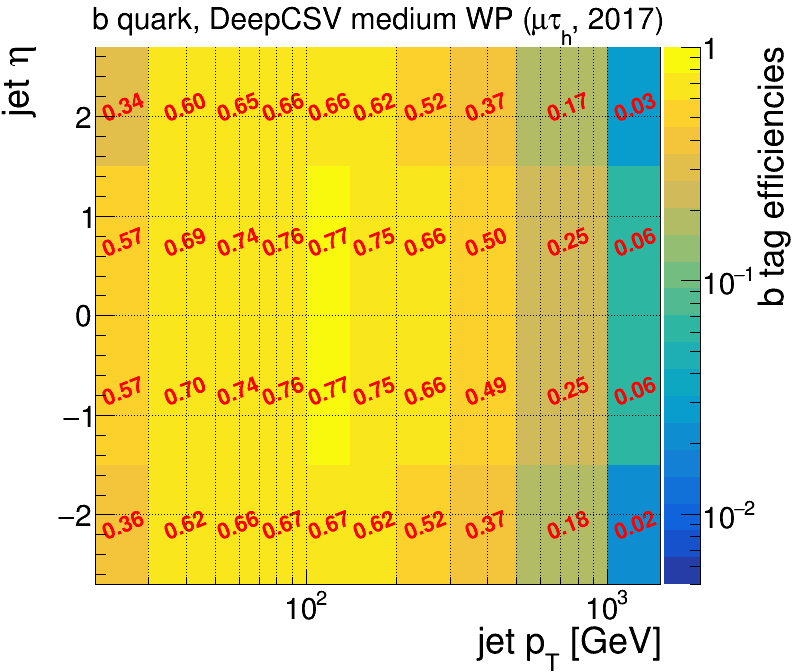
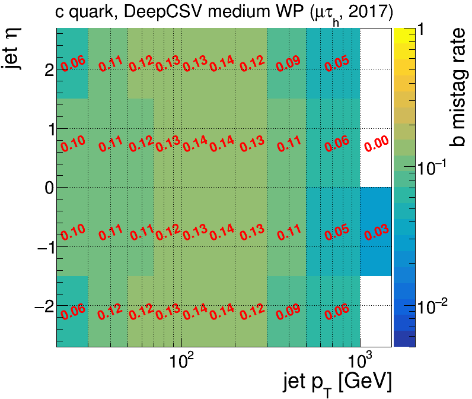
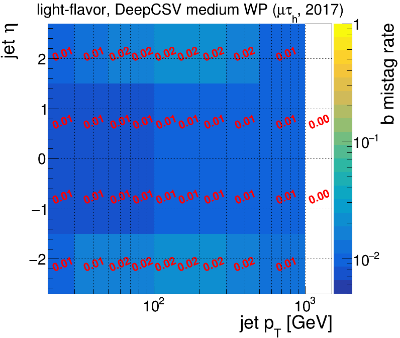

# Correction Tools
Several tools to get corrections, efficiencies, scale factors (SFs), event weights, etc.

* [Pileup reweighting](#pileup-reweighting)<br>
* [Lepton efficiencies](#lepton-efficiencies)<br>
* [Tau scale factors](#Tau-scale-factors)<br>
* [B tagging tools](#b-tagging-tools)<br>
* [Z pT reweighting](#Z-pT-reweighting)<br>
* [Test SFs](test-sfs)

Data for corrections is saved in in [`../../data/`](../../data)


## Pileup reweighting

[`PileupTool.py`](PileupTool.py) provides the pileup event weight based on the data and MC profiles in [`data/pileup/`](pileup).
Please note that the official tools also provide the
[`puWeightProducer.py`](https://github.com/cms-nanoAOD/nanoAOD-tools/blob/master/python/postprocessing/modules/common/puWeightProducer.py) module.

The data profile can be computed with the `pileupCalc.py` tool.
The MC profile can be taken from the distribution of the `Pileup_nTrueInt` variable in nanoAOD, for each MC event:
```
    self.out.pileup.Fill(event.Pileup_nTrueInt)
```
and then extracted with [`data/pileup/getPileupProfiles.py`](../../data/pileup/getPileupProfiles.py).
A simple module, [`PicoProducer/python/analysis/PileUp.py`](../analysis/PileUp.py) is already provided. Run as:
```
pico.py channel pileup PileUp # link channel to module
pico.py submit -c pileup -y UL2016 --dtype mc
# wait until the jobs are done
pico.py hadd -c pileup -y UL2016 --dtype mc
./getPileupProfiles.py -y UL2016 -c pileup
```
Comparisons are shown here:
[2016](https://ineuteli.web.cern.ch/ineuteli/pileup/2016/),
[2017](https://ineuteli.web.cern.ch/ineuteli/pileup/2017/),
[2018](https://ineuteli.web.cern.ch/ineuteli/pileup/2018/),
[UL2016](https://ineuteli.web.cern.ch/ineuteli/pileup/UL2016/),
[UL2017](https://ineuteli.web.cern.ch/ineuteli/pileup/UL2017/), and
[UL2018](https://ineuteli.web.cern.ch/ineuteli/pileup/UL2018/).

Please note that some (pre-UL) 2017 samples had a buggy pileup module, and need to be treated separately,
see [this](https://hypernews.cern.ch/HyperNews/CMS/get/generators/4060.html?inline=-1) or
[this HyperNews post](https://hypernews.cern.ch/HyperNews/CMS/get/physics-validation/3128.html).
`PileupTool.py` manually checks for some of these samples with the `hasBuggyPU` help function.
Also, [`data/pileup/getPileupProfiles.py`](../../data/pileup/getPileupProfiles.py) splits
the 2017 MC pileup profiles into those of the buggy (`old_pmx`) and fixed (`new_pmx`) samples.
You can find out if your favorite samples has a buggy pileup profile by passing its DAS path to
[`data/pileup/checkBuggyPileup2017.sh`](../../data/pileup/checkBuggyPileup2017.sh), which makes use of `dasgoclient`:
```
./pileup/checkBuggyPileup2017.sh /DY*JetsToLL_M-50_TuneCP5*mad*/RunIIFall17*/NANOAOD*
```

<p align="center">
  
  
  
</p>


## Lepton efficiencies

Several classes are available to get corrections for electrons, muons and hadronically-decayed tau leptons:

* `ScaleFactorTool.py`
  * `ScaleFactor`: general class to get SFs from histograms
  * `ScaleFactorHTT`: class to get SFs from histograms, as measured by the [HTT group](https://github.com/CMS-HTT/LeptonEfficiencies)
* `MuonSFs.py`: class to get muon trigger / identification / isolation SFs
* `ElectronSFs.py` class to get electron trigger / identification / isolation SFs

`ROOT` files with efficiencies and SFs are saved in [`lepton`](lepton) and [`tau`](tau). 
Scale factors can be found here:
* muon efficiencies and SFs: [Muon POG Run-II Recommendations](https://twiki.cern.ch/twiki/bin/view/CMS/MuonReferenceSelectionAndCalibrationsRun2) ([2016 Legacy](https://twiki.cern.ch/twiki/bin/view/CMS/MuonReferenceEffs2016LegacyRereco), [2017](https://twiki.cern.ch/twiki/bin/view/CMS/MuonReferenceEffs2017), [2018](https://twiki.cern.ch/twiki/bin/view/CMS/MuonReferenceEffs2018))
* electron efficiencies and SFs: [Electron POG](https://twiki.cern.ch/twiki/bin/view/CMS/EgammaIDRecipesRun2) ([2017](https://twiki.cern.ch/twiki/bin/view/CMS/Egamma2017DataRecommendations))
* tau triggers SFs (ditau, mutau, etau; [2016](https://github.com/rmanzoni/triggerSF/tree/moriond17), [2017](https://github.com/truggles/TauTriggerSFs/tree/final_2017_MCv2))

In case you use lepton scale factors and efficiencies as measured by the HTT group, you need to make sure you get them with
```
cd lepton
git clone https://github.com/CMS-HTT/LeptonEfficiencies HTT
```


## Tau scale factors

Please use the official TauID tool. Installation instructions are given in the [top README](../../../../../#picoproducer).


## B tagging tools

[`BTagTool.py`](BTagTool.py) provides two classes: `BTagWPs` for saving the working points (WPs) per year and type of tagger, and `BTagWeightTool` to provide b tagging weights. These can be called during the initialization of you analysis module, e.g.:
```
class ModuleMuTau(Module):
  
  def __init__(self, ... ):
    # ...
    if not self.isData:
      self.btagTool = BTagWeightTool('DeepCSV','medium',channel=channel,year=year)
    self.deepcsv_wp = BTagWPs('DeepCSV',year=year)
  
  def analyze(self, event):
    nbtag = 0
    jets  = [ ]
    for jet in Collection(event,'Jet'):
      # ...
      jets.append(jet)
      if jet.btagDeepB > self.deepcsv_wp.medium:
        nbtag += 1
    if not self.isData:
      self.out.btagweight[0] = self.btagTool.getWeight(event,jets)
```

`BTagWeightTool` calculates b tagging reweighting based on the [SFs provided from the BTagging group](https://twiki.cern.ch/twiki/bin/viewauth/CMS/BtagRecommendation#Recommendation_for_13_TeV_Data)
and analysis-dependent efficiencies measured in MC. These are saved in `ROOT` files in [`data/btag/`](../../data/btag).
The event weight is calculated according to [this method](https://twiki.cern.ch/twiki/bin/viewauth/CMS/BTagSFMethods#1a_Event_reweighting_using_scale).

### Computing the b tag efficiencies
The b tag efficiencies are analysis-dependent. They can be computed from the analysis output run on MC samples.
For each MC event, fill the numerator and denominator histograms with `BTagWeightTool.fillEfficiencies`,
after removing overlap with other selected objects, e.g. the muon and tau object in [`ModuleMuTau.py`](../python/analysis/ModuleMuTau.py):
<pre>
  def analyze(self, event):
    # select isolated muon and tau
    # ...
    jet = [ ]
    for jet in Collection(event,'Jet'):
      if jet.pt<30: continue
      if abs(jet.eta)>4.7: continue
      <b>if muon.DeltaR(jet)<0.5: continue
      if tau.DeltaR(jet)<0.5: continue</b>
      jets.append(jet)
    if not self.isData:
      self.btagTool.fillEfficiencies(jets)
    ...
</pre>
Do this for as many MC samples as possible, to gain as many events as possible
(also note that jets in Drell-Yan, W+jets and ttbar events typically have different jet flavor content).
Then edit and run [`data/btag/getBTagEfficiencies.py`](../../data/btag/getBTagEfficiencies.py) to extract all histograms from analysis output,
add them together for maximum statistics, and compute the efficiencies. (You should edit this script to read in your analysis output.)
Examples of efficiency maps per jet flavor, and as a function of jet pT versus jet eta for the mutau analysis in 2017 are shown
[here](https://ineuteli.web.cern.ch/ineuteli/btag/2017/?match=mutau).

<p align="center">
  
  
  
</p>


## Z pT reweighting

The observed Z pT spectrum is harder than in the LO MadGraph simulation, such as `DYJetsToLL_*_TuneCP5_13TeV-madgraphMLM-pythia8` samples.
Therefore LO Drell-Yan events have to be reweighted as a function of Z pT (and maybe other variables such as mass, jet multiplicity, and/or MET).
The TauFW provides a measurement tool in [`Fitter/Zpt/`](../../../Fitter/Zpt/).
The weights are stored in [`data/zpt/`](../../data/zpt/), and [`RecoilCorrectionTool.py`](RecoilCorrectionTool.py)
provides a tool to read them.
Alternatively, you can use a [simple `C++` macro](../../data/zpt/zptweight.C) to run it on the fly in `TTree::Draw`.

## Test SFs

`testSFs.py` provides a simple and direct way of testing the correction tool classes, without running the whole framework.


