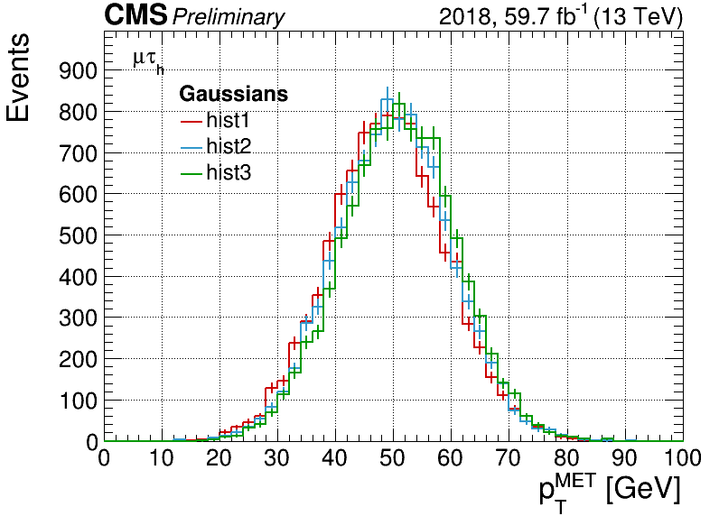
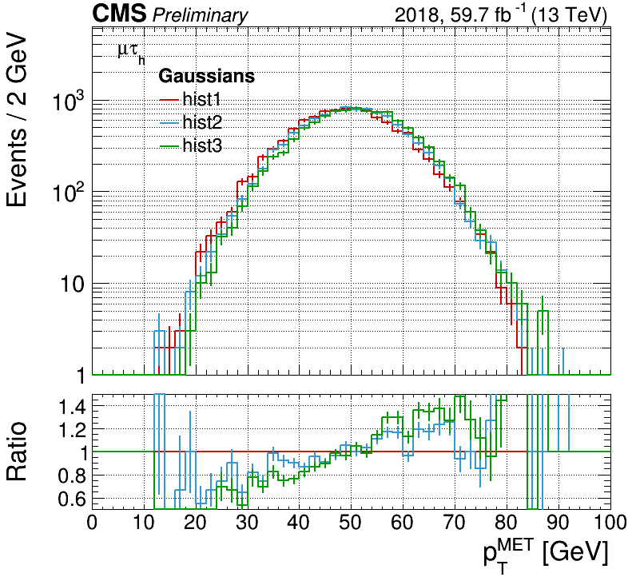
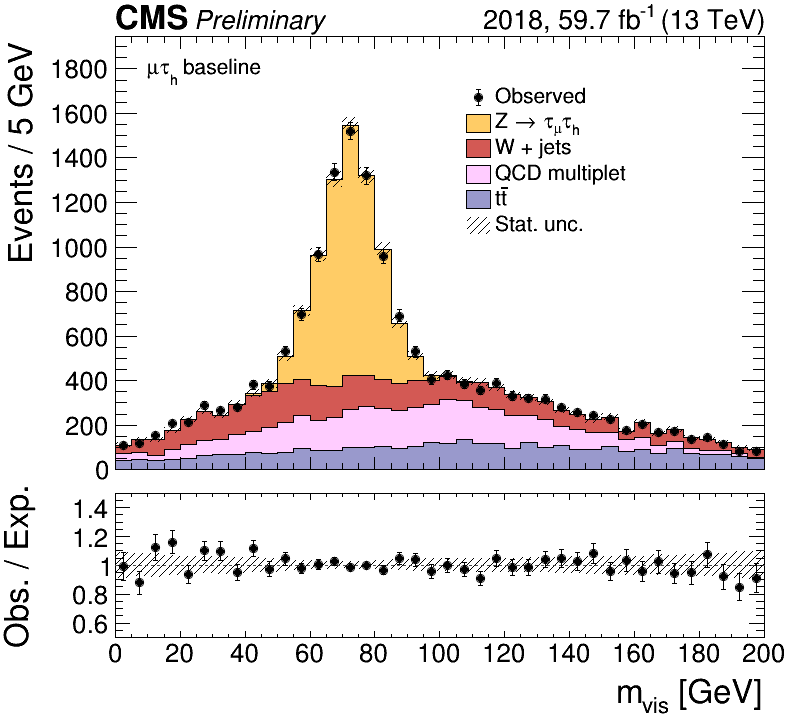
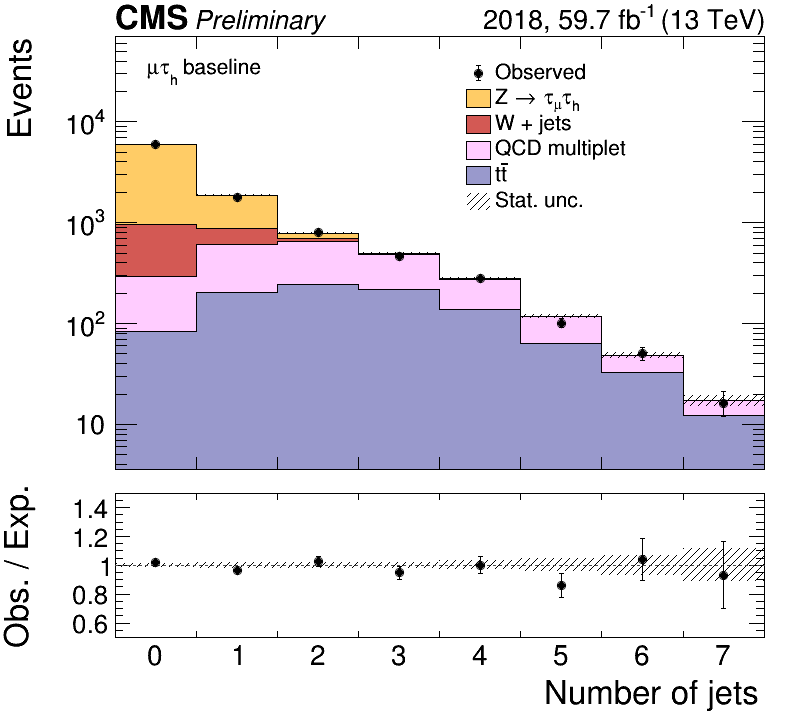
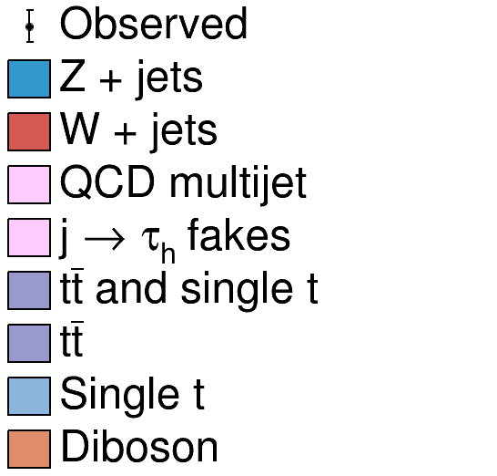
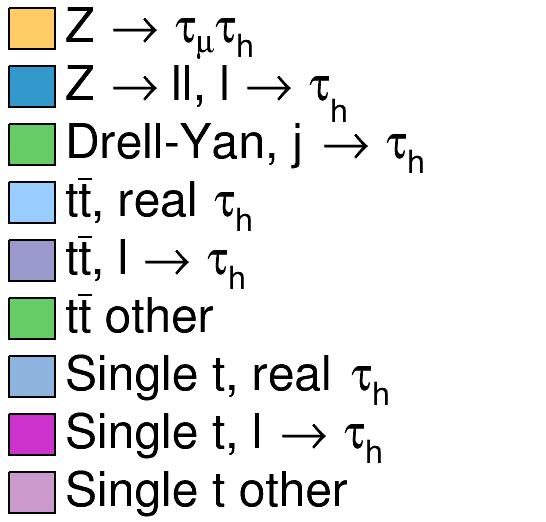
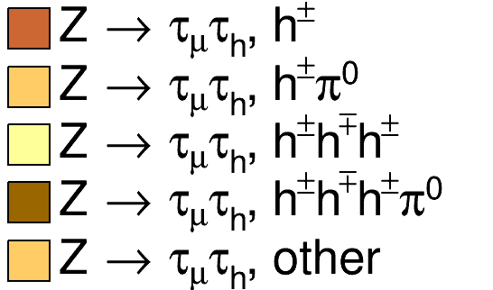

# TauFW Plotter

### Table of Contents  
* [Installation](#Installation)<br>
* [Basic plots](#Basic-plots)<br>
  * [Histogram comparison](#Histogram-comparison)<br>
  * [Data-MC comparison](#Data-MC-comparison)<br>
  * [CMS style](#CMS-style)<br>
* [Variable](#Variable)<br>
* [Sample](#Sample)<br>
  * [Creating histograms](#Creating-histograms)<br>
  * [Sample style](#Sample-style)<br>
  * [Splitting](#Splitting)<br>
* [Sample set](#Sample-set)<br>
  * [Initialization via table](#Initialization-via-table)<br>
  * [Joining samples](#Joining-samples)<br>
  * [Stitching samples](#Stitching-samples)<br>
  * [Splitting samples](#Splitting-samples)<br>
  * [Data/MC plots](#DataMC-plots)<br>
  * [Data-driven methods](#Data-driven-methods)<br>
* [Plotting script](#Plotting-script)<br>


## Installation
See [the README.md in the parent directory](../../../#TauFW).


## Basic plots

### Histogram comparison
Some classes are provided to facilitate making plots in CMS style.
If you have a list of histograms, `hists`, you want to compare with a ratio plot,
use the [`Plot`](python/plot/Plot.py) class, e.g.
```
from TauFW.Plotter.plot.Plot import Plot, CMSStyle
CMSStyle.setCMSEra(2018)
plot = Plot("x",hists)
plot.draw(ratio=True,grid=True,logy=True)
plot.drawlegend()
plot.saveas("plot.png")
plots.close()
```

<p align="center" vertical-align: middle>
  
  
</p>

### Data-MC comparison
If you want to make a data-MC comparison between a data histogram `datahist` and
a list of expected SM processes, `exphists`,
you can use the [`Stack`](python/plot/Stack.py) class, with something like
```
from TauFW.Plotter.plot.Stack import Stack, CMSStyle
CMSStyle.setCMSEra(2018)
plot = Stack("p_{T} [GeV]",datahist,exphists)
plot.draw(ratio=True,logy=False)
plot.drawlegend(pos='right')
plot.drawtext("#mu#tau_{h} baseline")
plot.saveas("stack.png")
plot.saveas("stack.pdf")
plots.close()
```

More examples of usage of `Plot` and `Stack` are provided in [`test/`](test/), run as
```
test/testPlot.py -v2
test/testStack.py -v2
```

<p align="center">
  
  
</p>


### CMS style
[`CMSStyle.py`](python/plot/CMSStyle.py) provides tools to make a plot have the CMS style.
The luminosity and center-of-mass energy are automatically set for a given year,
```
CMSStyle.setCMSEra(2018)
```
but can be manually set as
```
CMSStyle.setCMSEra(2018,lumi=59.7,cme=13,extra="Preliminary")
```
To change the default values, you can directly edit the hardcoded dictionaries:
```
import TauFW.Plotter.plot.CMSStyle as CMSStyle
CMSStyle.lumi_dict['UL2018'] = 59.8
CMSStyle.era_dict['UL2018'] = "2018"
```


## Variable
A [`Variable`](python/plot/Variable.py) class is provided to contain variable name (e.g. `pt_1`),
title (e.g. `Leading p_{T} [GeV]`) and the binning (`nbins,xmin,xmax` or a list of bins edges), for example:
```
from TauFW.Plotter.plot.Variable import Variable
variables = [
  Variable('pt_1',  "p_{T}",   40, 0,200),
  Variable('m_vis', "m_{vis}", [0,20,40,50,60,65,70,75,80,85,90,100,120,150]),
  Variable('njets', "Number of jets", 8, 0,  8),
  Variable('nbtag', "Number of b jets", 8, 0,  8, weight="btagweight"),
  Variable('pt_1+pt_2+jpt_1', "S_{T}", 40, 0, 800, cut="jpt_1>50", fname="ST"),
]
```
A `Variable` object can contain a lot of information, passed as key-word arguments that are
useful when making plots (e.g. `ymin`, `ymax`, `logx`, `logy`, `ymargin`, ...)
or selection strings (e.g. `cut`, `blind`, `weight`, ...).
It also has several handy functions that provide shortcuts for common routines.
For example, `Variable.gethist` can create a histogram for you:
```
hist = var.gethist()
```
and `Variable.drawcmd` can parse a draw command for [`TTree::Draw`](https://root.cern.ch/doc/master/classTTree.html#a73450649dc6e54b5b94516c468523e45):
```
var  = Variable('pt_1',40,0,200)
hist = var.gethist('hist') # returns a TH1D
dcmd = var.drawcmd('hist') # returns a string, e.g. "pt_1 >> hist"
tree.Draw(dcmd)            # loops over tree events and fills the histogram 'hist'
```
It can also be used to initialize a `Plot` or `Stack` object, e.g.
```
var  = Variable('pt_1',40,0,200,logy=True,ymargin=1.4)
plot = Plot(var,hists)
```
Examples are provided in [`test/testVariables.py`](test/testVariables.py).


## Sample
A [`Sample`](python/sample/Sample.py) class is provided to contain and interface your analysis ntuples (`pico`).
It keeps track of a sample's information like title (for legends), filename, cross section, normalization, etc.
To initialize, you need to pass a unique name, a title (for legends) and a filename:
```
sample = Sample("TT","t#bar{t}","TT_mutau.root",831.76)
```
The fourth argument can be a float that is the cross section (in units of pb).
It will be used by `Sample.normalize` to compute the normalization to the integrated luminosity times cross section as
```
norm = lumi*xsec*1000/sumw
```
if the total sum of weights, `sumw`, of all MC samples is given, otherwise the total number of MC events `nevts` is used.
The total number of events and total sum of weights will automatically be taken from the
[`'cutflow'` histogram](../PicoProducer/python/analysis/#Cutflow) if it exists,
otherwise, the user should pass it directly with `nevts` or `sumw`:
```
sample = Sample("TT,"t#bar{t}","TT_mutau.root",831.76,nevts=76915549,lumi=59.7)
```
Instead of passing the integrated luminosity with `lumi` (in units of inverse fb) to `Sample`, you can set it globally
in [`python/sample/utils.py`](python/sample/utils.py) by passing the era like this:
```
from TauFW.Plotter.sample.utils import setera
setera(2018)
```
This will also immediately set the era for plots via `CMSStyle`. To set the era manually,
directly edit the dictionary `lumi_dict` in the `python/sample/utils.py`, or use
```
setera(2018,59.7)
```

### Creating histograms
`Sample` provides a useful method that can create and fill a histogram (`TH1D`) for some variable.
It can be called in several ways:
```
var  = Variable('m_vis',40,0,200)
hist = sample.gethist('m_vis',40,0,200,"pt_1>30 && pt_2>30")
hist = sample.gethist('m_vis',[0,40,50,60,70,90,100,120,200],"pt_1>30 && pt_2>30")
hist = sample.gethist(var,"pt_1>30 && pt_2>30")
```
To speed up things, it can create histograms in parallel with [`MultiDraw`](python/plot/MultiDraw.py):
```
vars = [
  Variable('m_vis', 40,0,200),
  Variable('nbtags', 8,0,  8, weight="btagweight"),
  Variable('jpt_1', 40,0,200, cut="abs(jeta_1)<2.5", title="Forward jet pt"),
]
hists = sample.gethist(vars,"pt_1>30 && pt_2>30")
```
where `vars` is a list of variables as above, and the returned `hists` is a list of `TH1D`s.
Similarly, `Sample.gethist2D` is available for 2D histograms (`TH2D`).
With `Variable` objects, you can include extra cuts or weights that are variable-specific.
In the example above, the `btagweight` weight will only be applied to `nbtags`,
and the `jpt_1>0` cut only to `jpt_1`.

### Splitting
You can also split samples into different components (e.g. real/misidentified, or decay mode)
based on some cuts. e.g.
```
sample.split(('ZTT',"Real tau","genmatch_2==5"),
             ('ZJ', "Fake tau","genmatch_2!=5"))
hists = { }
for subsample in sample.splitsamples:
  hists[subsample] = subsample.gethist(vars,"pt_1>50")
```
Each component is defined by a unique name (e.g. `'ZTT'` and `'ZJ'`), a title `"Real tau"`, and a cut,
which must be orthogonal to the others to avoid overlap.
Examples are provided in [`test/testSamples.py`](test/testSamples.py):
```
test/testSamples.py -v2
```

### Sample style
The color and title style is predefined by dictionaries in [`python/sample/SampleStyle.py`](python/sample/SampleStyle.py).
These dictionaries are used to automatically set the color for `Sample` object if none is passed.
You can change the default sample colors and title to your preference as
```
import TauFW.Plotter.sample.SampleStyle as STYLE
STYLE.sample_colors['ZTT'] = kOrange-4
STYLE.sample_titles['ZTT'] = "Z -> #tau#tau
```
Some string patterns for axis titles and legend entries are automatically converted to LaTeX format
by [`makelatex` in `python/plot/string.py`](python/plot/string.py). To disable this, pass the `latex=False`
option to the `Plot.draw`, `Plot.drawlegend` and , `Plot.drawtext` functions.

<p align="center">
  
  
   tautau split into decay modes" width="200"/>
</p>


## Sample set
The [`SampleSet`](python/sample/SampleSet.py) class helps to contain data and MC `Samples` objects:
```
from TauFW.Plotter.sample.SampleSet import SampleSet
samples = SampleSet(datasample,expsamples)
samples.printtable()
```
Here, `datasample` is a single `Sample` object of observed data,
while `expsamples` is a simple python list of `Sample` objects wrapping MC ntuples.

### Initialization via table
To make initialization of sample sets of `pico` ntuples easier,
you can use the help function [`getsampleset`](python/sample/utils.py), for example:
```
expsamples = [ # table of MC samples to be converted to Sample objects
  ('DY', "DYJetsToLL_M-10to50",  "Drell-Yan 10-50", 18610.0, {'extraweight': 'zptweight'} ),
  ('WJ', "WJetsToLNu",           "W + jets",        50260.0, ),
  ('TT', "TT",                   "ttbar",             831.76 ),
]
datasamples = ('Data', "SingleMuon_Run2016?", "Observed") # to be converted to Sample object
sampleset = getsampleset(datasamples,expsamples,era=2016)
```
Here, `expsamples` is a list of python tuples:
```
  ( GROUP, SAMPLE, TITLE, XSEC )
```
To pass special options via keywords, use an extra dictionary.
Here, group name `GROUP` and sample name `SAMPLE` correspond to what was used during [`pico` production](../PicoProducer#Samples).
Data is a single tuple:
```
  ( GROUP, SAMPLE, TITLE )
```
Here, `SAMPLE` should be the data set name (e.g. `SingleMuon_Run2016`) corresponding to a single `pico` file
(e.g. `SingleMuon_Run2016_mutau.root`) containing processed events of the whole data period,
or it can be a pattern (e.g. `SingleMuon_Run2016?`) for multiple files
(e.g. `SingleMuon_Run2016B_mutau.root`, `SingleMuon_Run2016C_mutau.root`, ...) 

By default, `getsampleset` will automatically assume the samples can be found via the pattern
```
"$PICODIR/$SAMPLE_$CHANNEL.root"
```
where `PICODIR` will be retrieved from the [`PicoProducer` config file](../PicoProducer#Configuration).
You can instead specify to `getsampleset` the file name pattern with the keyword `file`.
With the keyword option `url` you can pass a `XRootD` url that will be prepended to this pattern.

To get an overview of the samples, use
```
sampleset.printtable()
>>> Samples with integrated luminosity L = 35.9 / fb at sqrt(s) = 13 TeV
>>> Sample name                title                      xsec [pb]      nevents    sumweights      norm  weight        
>>> SingleMuon_Run2016         Observed                                                            1.000  
>>> ├─ SingleMuon_Run2016B     Observed                       -1.00  154054252.0  154054252.00     1.000  
>>> ├─ SingleMuon_Run2016C     Observed                       -1.00   64718679.0   64718679.00     1.000  
>>> ├─ SingleMuon_Run2016D     Observed                       -1.00   96657799.0   96657799.00     1.000  
>>> ├─ SingleMuon_Run2016E     Observed                       -1.00   87378748.0   87378748.00     1.000  
>>> ├─ SingleMuon_Run2016F     Observed                       -1.00   65047318.0   65047318.00     1.000  
>>> ├─ SingleMuon_Run2016G     Observed                       -1.00  147941144.0  147941144.00     1.000  
>>> └─ SingleMuon_Run2016H     Observed                       -1.00  171137991.0  171137991.00     1.000  
>>> DYJetsToLL_M-50            Drell-Yan 50                 4963.00  146280395.0  146277764.00     1.000  zptweight
>>> WJetsToLNu                 W + jets                    50260.00   86413370.0   86411825.00     1.000  
>>> TT                         ttbar                         831.76   76915549.0   76914152.00     0.388  ttptweight
```
The luminosity-cross section normalization is given by the `norm` column, which is [described above](#Sample).

A full example is given in [`test/plotPico.py`](test/plotPico.py).
This script assumes a complete list of 2016 `pico` ntuples in the [`mutau` channel](../PicoProducer/python/analysis/ModuleMuTau.py).

### Joining samples
Sometimes you want to group samples into one bigger merged sample,
to reduce the number of backgrounds on your plots, or treat them as one in a fit.
This can be done with by using the [`MergedSample`](python/sample/MergedSample.py) class,
but `SampleSet` provides a help function that does it for you, for example,
```
sampleset.join('DY',               name='DY', title="Drell-Yan"           )
sampleset.join('VV','WZ','WW','ZZ',name='VV', title="Diboson"             )
sampleset.join('TT','ST',          name='Top',title="ttbar and single top")
```
The name and (legend) title of the merged sample is passed by the keyword arguments `name` and `title`.
The first string arguments are different search terms or glob patterns (with `*` wildcards) that can be used to identify the samples you want to merge.

### Stitching samples
In the TauPOG, typically "jet-binned" samples of Drell-Yan (Z+jets) and W+jets are used,
like `DY[1-4]JetsToLL_M-50*` or `W[1-4]JetsToLNu*`. (Here "jet" means number of LHE-level partons.)
They increase the statistics, but overlap with their respective jet-inclusive sample.
Therefore a special "stitching" procedure is needed that changes the effective
luminosity-cross section normalization per "jet-bin", before they are merged into one big sample.
You can use the [`stitch` help function](python/sample/utils.py) to do it automatically:
```
sampleset.stitch("W*Jets",   incl='WJ', name='WJ'                               )
sampleset.stitch("DY*J*M-50",incl='DYJ',name="DY_M-50",title="Drell-Yan M=50GeV")
```
Again, the first strings arguments are search terms or patterns to identify the samples you want to stitch together.
The keyword argument `incl` is the search term to identify the inclusive samples (e.g. `DYJetsToLL_M-50` or `WJetsToLNu`).
As per HTT convention, the branch variable name that indicates the number of partons ("jets") is called `NUP`.
This variable corresponds to [`LHE_Njets` in nanoAOD](https://github.com/cms-sw/cmssw/blob/master/PhysicsTools/NanoAOD/plugins/LHETablesProducer.cc).

To understand how the normalization is computed, look in [`python/sample/utils.py`](python/sample/utils.py),
and pass `stitch` the option `verbosity=2` to printout a table.

The k-factor is computed on the fly. You can set the (N)NLO cross section via the `xsec` keyword,
or by changing the hardcoded `xsecs_nlo` dictionary in `utils.py`.

In the end, after merging and stitching, you might obtain something a summary table like this:
```
sampleset.printtable()
>>> Samples with integrated luminosity L = 35.9 / fb at sqrt(s) = 13 TeV
>>> Sample name                title                      xsec [pb]      nevents    sumweights      norm  weight        
>>> SingleMuon_Run2016         Observed                                                            1.000  
>>> ├─ SingleMuon_Run2016B     Observed                       -1.00  154054252.0  154054252.00     1.000  
>>> ├─ SingleMuon_Run2016C     Observed                       -1.00   64718679.0   64718679.00     1.000  
>>> ├─ SingleMuon_Run2016D     Observed                       -1.00   96657799.0   96657799.00     1.000  
>>> ├─ SingleMuon_Run2016E     Observed                       -1.00   87378748.0   87378748.00     1.000  
>>> ├─ SingleMuon_Run2016F     Observed                       -1.00   65047318.0   65047318.00     1.000  
>>> ├─ SingleMuon_Run2016G     Observed                       -1.00  147941144.0  147941144.00     1.000  
>>> └─ SingleMuon_Run2016H     Observed                       -1.00  171137991.0  171137991.00     1.000  
>>> DY                         Drell-Yan                                                           1.000  
>>> ├─ DYJetsToLL_M-10to50     Drell-Yan 10-50             18610.00   35114961.0   35114342.00    19.026  zptweight
>>> └─ DY_M-50                 Drell-Yan M=50GeV                                                   1.000  
>>>    ├─ DYJetsToLL_M-50      Drell-Yan 50                 4963.00  146280395.0  146277764.00     1.000  zptweight
>>>    ├─ DY1JetsToLL_M-50     Drell-Yan 1J 50              1012.00   63730337.0   63729233.00     0.476  zptweight
>>>    ├─ DY2JetsToLL_M-50     Drell-Yan 2J 50               334.70   19879279.0   19878905.00     0.495  zptweight
>>>    ├─ DY3JetsToLL_M-50     Drell-Yan 3J 50               102.30    5857441.0    5857336.00     0.507  zptweight
>>>    └─ DY4JetsToLL_M-50     Drell-Yan 4J 50                54.52    4197868.0    4197790.00     0.413  zptweight
>>> WJ                         W + jets                                                            1.000  
>>> ├─ WJetsToLNu              W + jets                    50260.00   86413370.0   86411825.00     1.000  
>>> ├─ W1JetsToLNu             W + 1J                       9625.00   43773492.0   43772700.00     7.012  
>>> ├─ W2JetsToLNu             W + 2J                       3161.00   60366929.0   60365816.00     2.111  
>>> ├─ W3JetsToLNu             W + 3J                        954.80   59300029.0   59298987.00     0.689  
>>> └─ W4JetsToLNu             W + 4J                        494.60   29941394.0   29940855.00     0.706  
>>> VV                         Diboson                                                             1.000  
>>> ├─ WW                      WW                             75.88    7982180.0    7982164.32     0.341  
>>> ├─ WZ                      WZ                             27.60    3997571.0    3997499.00     0.248  
>>> └─ ZZ                      ZZ                             12.14    1988098.0    1988063.00     0.219  
>>> Top                        ttbar and single top                                                1.000  
>>> ├─ ST_t-channel_top        ST t-channel t                136.02   31848000.0   31835196.51     0.153  
>>> ├─ ST_t-channel_antitop    ST t-channel at                80.95   17780700.0   17771156.67     0.164  
>>> ├─ ST_tW_top               ST tW                          35.85    4983500.0  173905506.74     0.007  
>>> ├─ ST_tW_antitop           ST atW                         35.85    4980600.0  174107294.88     0.007  
>>> └─ TT                      ttbar                         831.76   76915549.0   76914152.00     0.388  ttptweight
```
This is the output of the full example given in [`test/plotPico.py`](test/plotPico.py).
This script assumes a complete list of 2016 `pico` ntuples in the [`mutau` channel](../PicoProducer/python/analysis/ModuleMuTau.py).

### Splitting samples
Like described [above](#Sample), you can split samples via `SampleSet`:
```
sampleset.split('DY',[
  ('ZTT',"Z -> tau_{#mu}tau_{h}",      "genmatch_2==5"),
  ('ZL', "Drell-Yan with l -> tau_{h}","genmatch_2>0 && genmatch_2<5"),
  ('ZJ', "Drell-Yan with j -> tau_{h}","genmatch_2==0")
])
```

### Data/MC plots
The `SampleSet` class can create and fill histograms for you:
```
result = samples.gethists(var,selection)
print result.var                 # Variable
print result.data                # TH1D
print result.exp                 # list of TH1Ds
var, datahist, exphists = result # Variable, TH1D, list
```
Or with `MultiDraw` for many variables:
```
result = samples.gethists(vars,selection)
print result.vars                # list of Variable
print result.data                # dictionary of Variable object to TH1D
print result.exp                 # dictionary of Variable object to list of TH1Ds
for var, datahist, exphists in result:
  print var, datahist, exphists  # Variable, TH1D, list
```
Here, `result` is a [`HistSet`](python/sample/HistSet.py) object, which contains a list of `Variable` objects,
and dictionaries for data and MC histograms.

Alternatively, you can immediately prepare the histograms into a `Stack` plot:
```
stacks = samples.getstack(variables,selection)
for stack in stacks:
  stack.draw()
  stack.drawlegend()
  stack.saveas()
  stack.close()
```
Examples are provided in `test/testSamples.py`.

### Data-driven methods
Data-driven background methods like QCD or j → 𝜏<sub>h</sub> fake estimation can be added as plug-ins
in [`python/methods/`](python/methods/). A python file should contain a function of the same name,
e.g. for the [`QCD_OSSS.py`](python/methods/QCD_OSSS.py) example:
```
from TauFW.Plotter.sample.SampleSet import SampleSet
def QCD_OSSS(self, variables, selection, **kwargs):
  ...
  return qcdhists
SampleSet.QCD_OSSS = QCD_OSSS # add as class method of SampleSet
```
The method returns a list of `TH1` histograms that correspond one-to-one to the list of `variables`.
These histograms are subsequently inserted in the list of MC histograms.

To use them, specify the method name when using `SampleSet.getstack` or `SampleSet.gethists`:
```
stacks = samples.getstack(variables,selection,method='QCD_OSSS')
```
This will load the file and make the method available.
You can set the position of the new histogram in the stack via `imethod`,
where `0` means on the top, and `-1` means on the bottom.


## Plotting script
An example of a plotting script is given by [`plot.py`](plot.py).
It can be run for a given channel and era as
```
./plot.py -c mutau -y 2018
```
It will load a `SampleSet` from `config/samples.py`, which by default will look for pico samples in `$PICODIR`.
You can edit the scripts and this config file to your specifications and liking.


