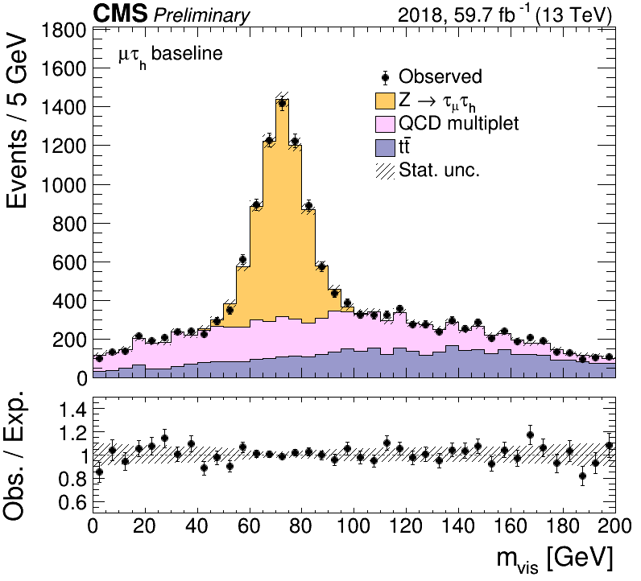
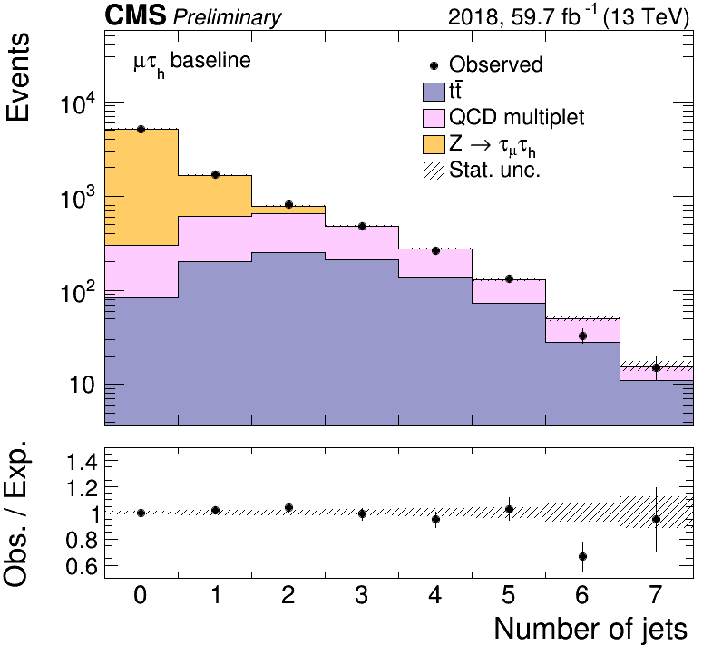

# TauFW Plotter

### Table of Contents  
* [Installation](#Installation)<br>
* [Basic plots](#Basic-plots)<br>
* [CMS style](#CMS-style)<br>
* [Variable](#Variable)<br>

## Installation
See [the README.md in the parent directory](../../../#taufw).


## Basic plots

### Histogram comparisons
Some classes are provided to facilitate making plots in CMS style.
If you have a list of histograms, `hists`, you want to compare with a ratio plot,
use the [`Plot`](python/plot/Plot.py) class, e.g.
```
from TauFW.Plotter.plot.Plot import Plot, CMSStyle
CMSStyle.setCMSEra(2018)
plot = Plot("x",hists)
plot.draw(ratio=True,grid=True,logy=True)
plot.drawlegend()
plot.saveas("plot.png")
plots.close
```

<p align="center" vertical-align: middle>
  
  
</p>

### Data-MC comparisons
If you want to make a data-MC comparison between a data histogram `datahist` and
a list of expected SM processes, `exphists`,
you can use the [`Stack`](python/plot/Stack.py) class, with something like
```
from TauFW.Plotter.plot.Stack import Stack, CMSStyle
CMSStyle.setCMSEra(2018)
plot = Stack("p_{T} [GeV]",datahist,exphists)
plot.draw(ratio=True,logy=False)
plot.drawlegend()
plot.drawtext("#mu#tau_{h} baseline")
plot.saveas("stack.png")
plot.saveas("stack.pdf")
plots.close
```
More examples of usage are provided in [`test/`](test/), run as
```
test/plotHists.py
test/plotStacks.py
```

<p align="center">
  
  
</p>


## CMS style
[CMSStyle.py](python/plot/CMSStyle.py) provides tools to make a plot have the CMS style.
The luminosity and center-of-mass energy are automatically set for a given year,
```
CMSStyle.setCMSEra(2018)
```
but can be manually set as
```
CMSStyle.setCMSEra(2018,lumi=59.7,cme=13,extra="Preliminary")
```


## Variable
A [`Variable`](python/plot/Variable.py) class is provided to contain variable name (e.g. `pt_1`),
title (e.g. `Leading p_{T} [GeV]`) and the binning (`(nbins,xmin,xmax)` or a list for variable binning), for example:
```
variables = [
  Variable('pt_1',  "p_{T} [GeV]",   40, 0,200),
  Variable('m_vis', "m_{vis} [GeV]", [0,20,40,50,60,65,70,75,80,85,90,100,120,150]),
  Variable('njets', "Number of jets", 8, 0,  8),
]
```
A `Variable` object can contain a lot of information, passed as key-word arguments that are
useful when making plots (e.g. `ymin`, `ymax`, `logx`, `logy`, `ymargin`, ...)
or selection strings (e.g. `cut`, `blind`, `weight`, ...).
It also has several handy functions that provide shortcuts for common routines.
For example, `Variable.gethist` can create a histogram for you:
```
hist = var.gethist()
```
and `Variable.drawcmd` can parse a draw command for [`TTree::Draw`](https://root.cern.ch/doc/master/classTTree.html#a73450649dc6e54b5b94516c468523e45):
```
var  = Variable('pt_1',40,0,200)
hist = var.gethist('hist') # returns a TH1D
dcmd = var.drawcmd('hist') # returns a string, e.g. "pt_1 >> hist"
tree.Draw(dcmd)            # loops over tree events and fills the histogram 'hist'
```
It can also be used to initialize a `Plot` or `Stack` object, e.g.
```
var  = Variable('pt_1',40,0,200,logy=True,ymargin=1.4)
plot = Plot(var,hists)
```
Examples are provided in [`test/testVariables.py`](test/testVariables.py).
